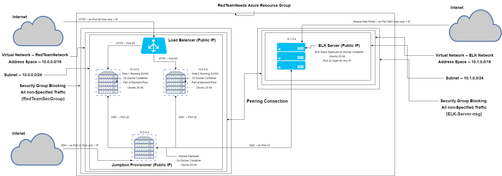

## Automated ELK Stack Deployment

The files in this repository were used to configure the network depicted below.

These files have been tested and used to generate a live ELK deployment on Azure. They can be used to recreate the entire deployment pictured above. Alternatively, select portions of the _____ file may be used to install only certain pieces of it, such as Filebeat. *** This paragraph is just all kinds of confusing. ***

  - _TODO: Enter the playbook file._

This document contains the following details:
- Description of the Topology
- Access Policies
- ELK Configuration
  - Beats in Use
  - Machines Being Monitored
- How to Use the Ansible Build

### Description of the Topology

The main purpose of this network is to expose a load-balanced and monitored instance of DVWA, the Damn Vulnerable Web Application.

Load balancing ensures that the application will be highly available, in addition to restricting access to the network by acting as a gateway to the webservers thus shielding the web servers from the Internet directly. Load balancers also protect against DDoS attacks. *** Why have a TO-DO about the jump box when the sentence with the fields doesn't reference the jump box at all? ***

Integrating an ELK server allows users to easily monitor the vulnerable VMs for changes to the system logs and system performance. *** This seems both very specific and very vague. ***

The configuration details of each machine may be found below.

| Name               | Function                    | IP Address | Operating System |
|--------------------|-----------------------------|------------|------------------|
| JumpBoxProvisioner | Ansible Server and Gateway  | 10.0.0.4   | Ubuntu 20.04     |
| Web-1              | DVWA Web Server             | 10.0.0.5   | Ubuntu 20.04     |
| Web-2              | DVWA Web Server             | 10.0.0.6   | Ubuntu 20.04     |
| ELK-Server         | ELK Server                  | 10.0.1.4   | Ubuntu 20.04     |

### Access Policies

The machines on the internal network are not exposed to the public Internet. *** This statement is simply false. ***

Only the JumpBoxProvisioner machine can accept connections from the Internet. Access to this machine is only allowed from the following IP addresses:
- My residential IP address which I will not print here.

Machines within the network can only be accessed by the JumpBoxProvisioner.

A summary of the access policies in place can be found in the table below.

| Name     | Publicly Accessible | Allowed IP Addresses |
|----------|---------------------|----------------------|
| From JumpBoxProvisioner | Yes/No              | 10.0.0.1 10.0.0.2    |
|          |                     |                      |
|          |                     |                      |

### Elk Configuration

Ansible was used to automate configuration of the ELK machine. No configuration was performed manually, which is advantageous because of many reasons. It's main advantage is its representation of infrastructure as code (IAC). In case configuration needs to be performed again, we're guaranteed to get the same configuration and avoid manual keying errors. Also, the Ansible playbook acts as documentation of exactly what was configured for future reference.

The playbook implements the following tasks:
- Using Ansible's "apt" module, "docker.io" and "pip" (Python's package manager) are installed.
- Using Ansible's "pip" module, the "docker" Python SDK is installed.
- Virtual memory is increased so ELK can run properly. See the following: [Virtual Memory and ELK](https://www.elastic.co/guide/en/elasticsearch/reference/current/vm-max-map-count.html)
- Using Ansible's "docker_container" module, a docker ELK container is downloaded and launched.
- Using Ansible's "systemd" module, the docker service is set so it launches upon boot.

The following screenshot displays the result of running `docker ps` after successfully configuring the ELK instance.

### Target Machines & Beats
This ELK server is configured to monitor the following machines:
- Web-1: 10.0.0.5
- Web-2: 10.0.0.6

We have installed the following Beats on these machines:
- Filebeat
- Metricbeat

These Beats allow us to collect the following information from each machine:
- Metricbeat will collect metrics and statistics from both a machine's operating system as well as the services running on the machine. One of the basic stats I would expect to see is the machine's CPU usage.
- Filebeat will monitor logs -- we set which logs to monitor -- and track changes to those logs. Given we're shipping log data off to an ELK server, I would expect to see log change events related to Kibana, Elasticsearch, Metricbeat, etc.

### Using the Playbook
In order to use the playbook, you will need to have an Ansible control node already configured. Assuming you have such a control node provisioned: 

SSH into the control node and follow the steps below:
- Copy the "install-elk.yml" file to "/etc/ansible".
- Update the _____ file to include...
- Run the playbook, and navigate to http://52.165.177.244:5601/app/kibana to check that the installation worked as expected.

_TODO: Answer the following questions to fill in the blanks:_
- _Which file is the playbook? Where do you copy it?_
- _Which file do you update to make Ansible run the playbook on a specific machine? How do I specify which machine to install the ELK server on versus which to install Filebeat on?_
- _Which URL do you navigate to in order to check that the ELK server is running?

_As a **Bonus**, provide the specific commands the user will need to run to download the playbook, update the files, etc._
